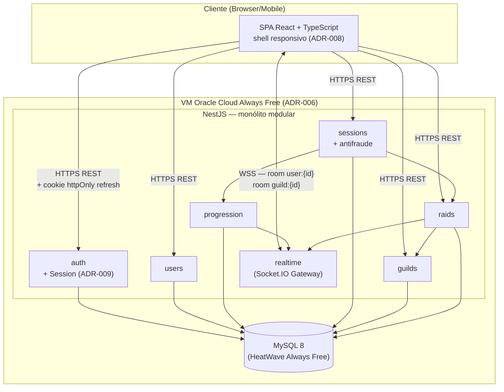

# Wise Warrior — PRD (Product Requirements Document)

**Versão:** 1.1
**Branch:** `dev/phase-1`
**Autor:** Assistente técnico (Claude Code), a partir da síntese dos documentos orientadores do Grupo 2
**Data:** 21/08/2026 (v1.0) — revisado em 21/08/2026 (v1.1, decisões fechadas com o Product Owner)
**Status:** Decisões de escopo e infraestrutura fechadas nesta revisão (ver seção 3.8); pendente apenas de execução

### Registro de decisões fechadas em 21/08/2026
| Ponto aberto | Decisão | ADR |
|---|---|---|
| Koa.js na stack | Removido — só NestJS | ADR-002 (Aceito) |
| Feature "Companheiro" | Adiada para Fase 2 | ADR-004 (Aceito) |
| Provedor de nuvem / hosting | Oracle Cloud Always Free, mantendo MySQL + NestJS | ADR-006 (Aceito) |
| Redis Adapter | Adiado — reforçado pelo limite de recursos do Oracle Always Free | ADR-003 (Aceito) |
| Modelo freemium | Flags de entitlement (`plan_tier`) entram já na Fase 1; gateway de pagamento continua fora | ADR-007 (Aceito) |

> Este documento consolida e substitui as lacunas dos documentos orientadores (Documento de Visão, Documento de Arquitetura, Documentação de Interface, Pitch e Casos de Uso UC01–UC04), resolvendo inconsistências entre eles e propondo um caminho técnico único para a Fase 1 de desenvolvimento.

---

## 1. Sumário executivo

Wise Warrior é uma plataforma web de produtividade gamificada: usuários realizam sessões de estudo temporizadas (Pomodoro), acumulam XP, evoluem de nível, customizam avatar/companheiro RPG e cooperam em guildas através de raids semanais. Hoje o projeto **só possui documentação** (Visão, Arquitetura, Interface, Pitch, 4 casos de uso) — nenhum código foi escrito. Este PRD parte da leitura crítica desses seis documentos, identifica onde eles se contradizem ou deixam lacunas, e define o que deve ser construído na Fase 1 (`dev/phase-1`).

---

## 2. Estado atual — o que os documentos já decidiram

| Decisão | Fonte | Conteúdo |
|---|---|---|
| Domínio do produto | Documento de Visão | Sessões Pomodoro + XP/níveis + guildas + raids semanais + ranking + chat + perfil customizável |
| Estilo arquitetural | Doc. de Arquitetura v1.0 | Cliente-servidor + monólito modular em 4 camadas (Apresentação → Aplicação → Domínio → Infraestrutura), 8 módulos de backend |
| Stack backend | Doc. de Arquitetura | Node.js LTS, NestJS, TypeORM, Socket.IO + Redis Adapter, JWT (access+refresh) com Argon2id |
| Stack frontend | Doc. de Arquitetura + Doc. de Interface | React 18+, TypeScript, Vite, React Router v6, Axios, socket.io-client, react-i18next (pt-BR) |
| Banco de dados | Todos os documentos | MySQL 8 (AWS RDS Multi-AZ) |
| Infraestrutura | Doc. de Arquitetura + Pitch | AWS ECS Fargate, ELB, CloudFront, CloudWatch, ElastiCache (Redis) |
| Design system | Doc. de Interface | Paleta dark-RPG (tokens de cor documentados), tipografia (Cinzel/Inter/JetBrains Mono), componentes (cards, botões, barra de XP), diretrizes de acessibilidade (WCAG AA, `prefers-reduced-motion`) |
| Regras de negócio já especificadas | UC01–UC04 | Fórmula de XP por nível (`xp_base × N^1.5`, `xp_base = 500`), detecção de fraude por tempo de sessão anômalo, exclusividade de itens cosméticos por raid concluída, contribuição de sessão só é válida dentro da janela oficial da raid |
| Modelo de negócio (aspiracional) | Pitch Deck | Freemium: grátis (timer, XP, guilda básica) vs. premium (cosméticos exclusivos, raids avançados, perfil destacado) |

---

## 3. Inconsistências e lacunas identificadas

Esta é a análise crítica solicitada — onde os documentos se contradizem, ficam incompletos ou criam risco técnico se seguidos ao pé da letra.

### 3.1 Conflito de stack: README vs. Documento de Arquitetura
O `README.md` do repositório descreve o frontend como **"HTML · CSS · JavaScript"** e lista **Koa.js** como parte do backend. O Documento de Arquitetura (mais recente, v1.0) descreve o frontend como **SPA React + TypeScript** e não atribui nenhuma responsabilidade concreta ao Koa.js — todos os módulos de backend (auth, users, sessions, progression, guilds, raids, chat, notifications, shared) são descritos exclusivamente em termos de NestJS.
**Decisão proposta:** o Documento de Arquitetura prevalece (é o artefato técnico mais recente e detalhado). Koa.js deve ser **removido do escopo** — não há caso de uso que justifique um segundo framework HTTP rodando junto ao NestJS; isso apenas adicionaria complexidade operacional sem benefício. O README deve ser atualizado na Fase 1 para refletir React/TypeScript e remover Koa.js.

### 3.2 Feature "Companheiro" (mascote RPG) não rastreada
O UC01 (Realizar Sessão de Estudo) descreve em detalhe um sistema de **companheiro/mascote pixel art** que acompanha o usuário, ganha XP próprio e evolui — isso não aparece no Documento de Visão (seção 4.1, resumo de funcionalidades), no Documento de Arquitetura (módulos de backend) nem no Documento de Interface (telas T01–T06 e paleta). É uma funcionalidade com especificação comportamental rica, mas sem dono formal no escopo.
**Decisão fechada (ADR-004):** adiada para a Fase 2. Não entra no código da Fase 1. Fica registrada como sub-feature do módulo `progression` no backlog, para não ser esquecida nem reintroduzida como retrabalho de última hora.

### 3.3 Seções em branco no Documento de Visão
As seções 5 (Precedência e Prioridades), 6 (Requisitos Não-Funcionais), 7 (Restrições Técnicas) e partes da 4.4 estão com templates vazios (`[`, tabelas sem linhas). Um documento de visão sem NFRs e sem priorização MoSCoW não é utilizável para planejamento de sprint.
**Decisão proposta:** este PRD preenche essas lacunas nas seções 7, 8 e 9 abaixo, e deve substituir essas seções no Documento de Visão quando ele for revisado.

### 3.4 Infraestrutura: o time quer deploy 100% gratuito, e isso não está em nenhum documento
O Documento de Arquitetura, o Documento de Visão (seção 4.4) e o Pitch assumem AWS (EC2/ELB/ECS/CloudFront/RDS/ElastiCache) — uma stack paga desde o primeiro dia (o free tier de 12 meses da AWS não cobre o ano inteiro de projeto nem o pós-graduação). Na prática, o time quer rodar o projeto **inteiramente de graça**, o que nenhum dos seis documentos previu.
**Decisão fechada (ADR-006):** deploy em **Oracle Cloud Always Free** (VM Ampere A1 sempre grátis + MySQL HeatWave Always Free), substituindo AWS como alvo de infraestrutura. Isso preserva a stack já documentada (NestJS + MySQL) — só troca o provedor. Risco conhecido e aceito: a Oracle cortou os limites do Always Free em junho/2026 (de 4 OCPU/24GB para 2 OCPU/12GB) e começou a terminar instâncias fora do novo limite em 18/08/2026 — ver ADR-006 para o plano de mitigação. O Documento de Visão e o Documento de Arquitetura precisam ser atualizados para refletir Oracle em vez de AWS.
**Decisão fechada (ADR-003):** Redis continua adiado — e agora por dois motivos: (1) só é obrigatório a partir de 2 réplicas, e (2) a VM Always Free (2 OCPU/12GB) tem margem apertada para rodar NestJS + MySQL + Redis ao mesmo tempo sem competir por recursos.

### 3.5 Antifraude especificado, mas sem desenho técnico
O UC03 menciona bloqueio de XP para "tempo de sessão que fuja dos padrões humanos" (ex.: 24h ininterruptas), mas nenhum documento define o limiar, onde a validação ocorre (client, servidor, ou ambos) ou como isso se relaciona com o `SessionRepository`/`ProgressionService`.
**Decisão proposta:** ver RN-ANTIFRAUDE na seção 6.3 e o endpoint de encerramento de sessão na seção 9 — validação server-side obrigatória, o cliente nunca é fonte de verdade para duração de sessão.

### 3.6 Modelo de negócio (freemium) sem contrapartida técnica
O Pitch descreve tiers gratuito/premium, mas nenhum módulo de backend, entidade de dados ou NFR trata de billing, entitlements ou feature flags. Como o projeto é acadêmico com prazo de 1 ano e equipe de 4 pessoas, monetização real está fora do horizonte técnico responsável para a Fase 1.
**Decisão fechada (ADR-007):** o MVP não implementa gateway de pagamento. Mas as **flags de entitlement entram já na Fase 1**: campo `plan_tier` no perfil do usuário (seção 9.1) e checagem de feature flag nos endpoints/telas que o Pitch marca como premium (cosméticos exclusivos, raids avançados, perfil destacado) — hoje sempre liberadas para todos, mas já checando a flag em vez de hardcoded, para não exigir migração de dados quando a cobrança real entrar pós-MVP.

### 3.7 Sem estratégia de testes, CI/CD, observabilidade ou contrato de API formal
Nenhum dos seis documentos define pipeline de build/deploy, cobertura mínima de testes, ou um contrato de API/WebSocket explícito entre front e back — apesar de o front e o back serem times/módulos que precisam desse contrato para trabalhar em paralelo. Isso é o maior risco de atraso de cronograma dado o prazo de 1 ano com 4 pessoas.
**Decisão proposta:** seções 10 (API), 11 (dados), 12 (infraestrutura/CI-CD) e 13 (confiabilidade e testes) deste PRD cobrem essas lacunas.

### 3.8 Responsividade mobile não especificada
A Documentação de Interface só descreve layouts desktop (sidebar fixa de 280px na tela de Guilda, painel de três colunas na tela de Sessão) e nenhum dos seis documentos define breakpoints, comportamento de navegação em telas pequenas, tamanho mínimo de área de toque, ou se o produto é web responsivo ou aplicativo nativo. O pedido do usuário é explícito: **web responsivo** (não app nativo — não há App Store/Play Store no horizonte deste projeto).
**Decisão fechada (ADR-008):** o SPA React já decidido no Documento de Arquitetura passa a ser mobile-first responsivo, com breakpoints e adaptação de layout definidos na seção 13. Nenhum código nativo (React Native, Swift, Kotlin) entra no escopo — ver seção 13 e ADR-008 para o detalhamento.

### 3.9 Persistência de sessão multi-dispositivo não especificada
O usuário pediu que as informações se propaguem "no mesmo ambiente" por um sistema de credenciais — ou seja, login no celular e no notebook devem ver o mesmo progresso em tempo real. O Documento de Arquitetura já prevê JWT access+refresh, mas nenhum documento define: quantas sessões simultâneas por usuário, como revogar uma sessão específica (ex.: "sair de todos os dispositivos"), nem como eventos em tempo real (XP, level-up, raid) se propagam para todos os dispositivos logados do mesmo usuário ao mesmo tempo.
**Decisão fechada (ADR-009):** cada login gera uma sessão persistente própria (refresh token rotativo por dispositivo, tabela `Session` — seção 9), e o servidor propaga todo evento relevante do usuário pela room `user:{id}` do Socket.IO (seção 10), que recebe todas as conexões ativas desse usuário independentemente do dispositivo. Como o estado (XP, sessão, guilda) já é 100% server-side, a sincronização entre dispositivos é uma consequência natural da arquitetura — o que faltava era formalizar sessão multi-dispositivo e o fanout de eventos, o que este ADR resolve.

---

## 4. Caminho recomendado (visão conceitual)

1. **Confirmar a arquitetura de monólito modular em camadas** já descrita — é a escolha correta para equipe de 4 pessoas e prazo de 1 ano (ver ADR-001).
2. **Formalizar o contrato entre front e back antes de escrever código de tela** — usar o contrato de API da seção 10 como fonte única de verdade, permitindo front e back avançarem em paralelo com mocks.
3. **Tratar antifraude e cálculo de XP como regras de domínio puras, testáveis isoladamente** (camada de Domínio, sem I/O) — hoje elas só existem em prosa nos casos de uso.
4. **Adiar Redis para quando houver 2ª réplica real** — reduz custo e complexidade no MVP sem violar a arquitetura (Socket.IO funciona em réplica única sem adapter).
5. **Cortar cobrança/premium do escopo de código da Fase 1**, mantendo apenas os campos de dados que não bloqueiam essa evolução futura.
6. **Elevar "Companheiro"a item de backlog rastreado formalmente**, com prioridade definida pelo Product Owner (ver MoSCoW, seção 7).

---

## 5. Personas e stakeholders (herdado do Documento de Visão, sem alterações)

- **Usuário final** — estudantes, universitários, concurseiros.
- **Equipe de desenvolvimento** — 4 pessoas, prazo de 1 ano.
- **Product Owner** — prioriza backlog e valida entregas.

---

## 6. Escopo funcional — priorização MoSCoW (preenche a lacuna da seção 5 do Documento de Visão)

| Prioridade | Funcionalidade | Módulo | Observação |
|---|---|---|---|
| **Must** | Cadastro/login (JWT access+refresh) | `auth` | Base de tudo |
| **Must** | Timer Pomodoro com registro de sessão | `sessions` | Diferencial crítico (Documento de Visão) |
| **Must** | Cálculo de XP e nível | `progression` | Fórmula já definida no UC04 |
| **Must** | Guildas (criar/entrar) + ranking interno | `guilds` | Diferencial crítico |
| **Must** | Raids semanais com meta coletiva | `raids` | Diferencial crítico |
| **Must** | Validação server-side de sessão (antifraude) | `sessions`/`progression` | Gap da seção 3.5 |
| **Must** | Sessões persistentes multi-dispositivo (login em vários dispositivos, revogação, fanout de eventos) | `auth` | ADR-009 — pedido explícito do usuário |
| **Must** | Layout responsivo mobile-first (sem app nativo) | frontend `shared` | ADR-008 — pedido explícito do usuário |
| **Should** | Chat de guilda em tempo real | `chat` | Importante, mas depende de `guilds` estar estável |
| **Should** | Perfil com itens cosméticos e equipagem | `users` | Importante |
| **Should** | Notificações em tempo real (level-up, raid concluída, convite) | `notifications` | Importante |
| **Should** | Flags de entitlement (`plan_tier`) nos recursos marcados como premium no Pitch | `users`/`shared` | ADR-007 — sem gateway de pagamento, só a checagem de flag |
| **Could** | i18n multi-idioma (além de pt-BR) | frontend `shared` | `react-i18next` já preparado, mas só pt-BR é necessário no MVP |
| **Won't (nesta fase)** | Companheiro/mascote RPG com XP próprio | `progression` (sub-feature) | ADR-004 — adiado para Fase 2 |
| **Won't (nesta fase)** | Cobrança/assinatura premium (gateway de pagamento) | — | ADR-007 — fora do horizonte técnico da Fase 1 |
| **Won't (nesta fase)** | Parcerias educacionais / integrações externas | — | Modelo de negócio, não requisito técnico do MVP |

---

## 7. Requisitos funcionais (formato EARS)

**Sessões de estudo**
- Quando o usuário aciona "Iniciar Sessão" com matéria e duração configuradas, o sistema shall iniciar um temporizador regressivo no modo selecionado (Pomodoro/Pausa Curta/Pausa Longa).
- Quando um ciclo de foco é concluído, o sistema shall creditar XP parcial e exibir o progresso do companheiro (se habilitado) sem interromper o temporizador.
- Quando a sessão é encerrada pelo servidor como completa, o sistema shall registrar duração, matéria e XP total no histórico do usuário e shall contribuir a duração para a raid ativa da guilda, caso o modo seja Guilda.
- Se a duração reportada de uma sessão exceder o limite antifraude (ver RN-ANTIFRAUDE), o sistema shall descartar a sessão para fins de XP e ranking e shall registrar o evento para auditoria.
- Onde a conexão de rede for perdida durante uma sessão solo, o sistema shall preservar o progresso local e sincronizar ao reconectar.

**Progressão (XP/Nível)**
- O sistema shall calcular o XP necessário para o nível N como `500 × N^1.5`.
- Quando o XP acumulado do usuário atinge o limiar do próximo nível, o sistema shall disparar level-up, desbloquear os itens cosméticos associados a esse nível e shall notificar o usuário em tempo real.

**Guildas e Raids**
- Quando um usuário confirma participação em uma raid ativa, o sistema shall registrá-lo como participante e shall passar a contabilizar suas sessões válidas como contribuição.
- Enquanto uma raid estiver ativa, o sistema shall atualizar o progresso coletivo em tempo real para todos os membros conectados via WebSocket.
- Se a raid selecionada já tiver expirado, o sistema shall impedir nova participação e shall retornar o usuário à lista de raids disponíveis.

**Perfil e customização**
- Quando o usuário equipa um item cosmético desbloqueado, o sistema shall persistir a alteração e shall refletir a mudança no perfil visível por outros membros da guilda.
- Onde um item exigir conclusão de raid específica, o sistema shall bloquear a equipagem até que essa condição seja satisfeita.

**Sessão persistente multi-dispositivo (novo — ADR-009)**
- Quando um usuário efetua login, o sistema shall criar uma nova sessão persistente (linha em `Session`) sem invalidar sessões ativas em outros dispositivos, até um limite de 5 sessões simultâneas — ao exceder, o sistema shall revogar automaticamente a sessão menos recentemente usada.
- Quando qualquer evento de progresso (XP, nível, raid, convite de guilda) ocorre, o sistema shall propagá-lo em tempo real para todas as conexões WebSocket ativas do mesmo usuário, independentemente do dispositivo.
- Onde o usuário revoga uma sessão específica ou aciona "sair de todos os dispositivos", o sistema shall invalidar o(s) refresh token(s) correspondente(s) imediatamente, encerrando a conexão WebSocket associada.

**Responsividade (novo — ADR-008)**
- Onde a viewport for menor que 640px, o sistema shall recolher painéis laterais fixos (guilda, companheiro) em um drawer/bottom-sheet acionável, mantendo o timer ou conteúdo principal como foco central.
- O sistema shall garantir área de toque mínima de 44×44px em todo elemento interativo em viewports mobile.

*(Requisitos completos, com fluxos alternativos e de exceção, já estão detalhados nos UC01–UC04; este PRD não os duplica — apenas resolve as lacunas identificadas na seção 3.)*

### 7.3 Regra de negócio antifraude (RN-ANTIFRAUDE) — nova, preenche gap 3.5
- O backend shall considerar inválida qualquer sessão cuja duração reportada exceda 4 horas contínuas sem pausa registrada, ou cuja soma diária de sessões exceda 16 horas.
- A validação shall ocorrer exclusivamente no servidor, a partir de timestamps de início/fim gerados pelo servidor (heartbeat periódico, conforme UC03/S01) — o cliente não é fonte de verdade.
- Sessões descartadas por antifraude shall permanecer visíveis ao usuário com um indicador de "não contabilizada", nunca silenciosamente removidas.

### 7.4 Critérios de aceite — ADR-008 e ADR-009 (feature-forge)

**Responsividade (ADR-008)**
- Dado um usuário autenticado acessando de um viewport <640px, quando a tela de Guilda carrega, então o painel lateral fixo aparece como navegação inferior, não como sidebar de 280px.
- Dado qualquer botão ou link interativo em viewport mobile, quando renderizado, então sua área de toque é ≥44×44px.
- Dado `prefers-reduced-motion: reduce` ativo no sistema do usuário, quando qualquer animação (glow, level-up) ocorreria, então ela é substituída por uma transição de opacidade ou omitida.

**Sessão multi-dispositivo (ADR-009)**
- Dado um usuário já logado no notebook, quando ele faz login no celular, então a sessão do notebook permanece ativa e ambas aparecem em `GET /users/me/sessions`.
- Dado dois dispositivos logados do mesmo usuário, quando um deles ganha XP numa sessão de estudo, então o outro dispositivo recebe o evento `progress:xpUpdated` via WebSocket em até 1 segundo, sem recarregar a página.
- Dado um usuário com 5 sessões ativas, quando ele faz login num 6º dispositivo, então a sessão menos recentemente usada é revogada automaticamente.
- Dado um usuário que aciona "sair de todos os dispositivos", quando a ação é confirmada, então toda sessão ativa é revogada e cada dispositivo é desconectado do WebSocket na próxima tentativa de uso do access token expirado.

### 7.5 Checklist de implementação — backlog Must da Fase 1

- [x] `auth`: registro, login, refresh rotativo, logout, sessão multi-dispositivo (ADR-009)
- [x] `users`: perfil, listagem/revogação de sessões, equipar cosmético com checagem de `plan_tier` (ADR-007)
- [x] `progression`: fórmula de XP/nível como domínio puro testado, notificação de level-up em tempo real
- [x] `sessions`: start/heartbeat/complete, validação antifraude (RN-ANTIFRAUDE) como domínio puro testado
- [x] `guilds`: criar/entrar/detalhe
- [x] `raids`: entrar, registrar contribuição, ranking
- [x] `realtime`: gateway Socket.IO com rooms `user:{id}` e `guild:{id}`
- [x] Frontend: shell responsivo mobile-first (ADR-008), páginas de login/cadastro/dashboard/sessão/guilda/perfil
- [x] Contrato de API publicado e validado (`docs/api/openapi.yaml`, lint limpo — seção 10)
- [ ] `docs/api/asyncapi.yaml` (contrato dos eventos WebSocket) — ainda não escrito
- [ ] Migrations TypeORM versionadas (schema hoje só via `synchronize` em dev — ver seção 12)
- [ ] Provisionamento real da VM Oracle Always Free e primeiro deploy (ADR-006)
- [ ] Boot do NestJS + testes de integração contra MySQL real (não verificável neste ambiente de execução — ver seção 16)

---

## 8. Arquitetura — decisões (ADRs)

### ADR-001: Manter monólito modular em camadas (confirmado)
**Status:** Aceito. **Contexto:** equipe de 4, prazo de 1 ano, domínio fortemente acoplado (sessão→XP→progressão→raid→guilda). **Decisão:** manter a arquitetura já descrita no Documento de Arquitetura v1.0 (4 camadas, 8 módulos, regra de que cross-module calls passam pelo Service público do módulo destino). **Consequência:** extração futura para microsserviços permanece viável sem reescrita, mas não é necessária agora.

### ADR-002: Remover Koa.js do escopo técnico
**Status:** Aceito (fechado com o time em 21/08/2026). **Contexto:** README lista Koa.js, mas nenhum módulo do Documento de Arquitetura usa Koa para algo que o NestJS não cubra. **Decisão:** eliminar Koa.js da stack. NestJS (REST + DI) e Socket.IO (tempo real) cobrem 100% dos casos de uso documentados. **Consequência:** menos uma dependência para manter, testar e monitorar; README e Pitch precisam ser atualizados.

### ADR-003: Adiar Redis Adapter até a 2ª réplica real
**Status:** Aceito. **Contexto:** Redis só é *obrigatório* (conforme o próprio Documento de Arquitetura) a partir de 2 réplicas do backend; o MVP acadêmico roda em 1 réplica na VM Oracle Always Free (ADR-006), cujo limite de 2 OCPU/12GB não sobra muita margem para um terceiro processo. **Decisão:** implementar o código já com a interface de adapter abstraída (para não travar a extração futura), mas não provisionar Redis no ambiente de MVP. Ativar Redis apenas quando houver 2ª réplica real e capacidade de máquina para isso. **Consequência:** reduz custo e pressão de recursos na VM Always Free, sem violar a arquitetura alvo.

### ADR-004: Adiar "Companheiro" para a Fase 2
**Status:** Aceito (decisão do PO em 21/08/2026). **Contexto:** especificado em detalhe no UC01, ausente do Documento de Visão e da Documentação de Interface. **Decisão:** não entra no código da Fase 1. Quando priorizada, será modelada como entidade filha do agregado `Character`/`progression` (sem módulo `companion` separado), reutilizando o motor de XP/nível existente. **Consequência:** UC01 precisa ser marcado como "parcialmente Fase 2" até a feature ser implementada, para não gerar expectativa de comportamento que ainda não existe; Documento de Visão e Documentação de Interface devem ser atualizados quando a feature for de fato priorizada.

### ADR-005: MySQL confirmado como armazenamento primário
**Status:** Aceito. **Contexto:** todos os seis documentos convergem em MySQL 8; o domínio é relacional com integridade referencial forte (usuário→sessões→XP→guilda→raid). **Decisão:** manter MySQL 8 via TypeORM — e a escolha de infraestrutura (ADR-006, Oracle MySQL HeatWave Always Free) reforça essa decisão em vez de contestá-la. PostgreSQL foi avaliado como alternativa (JSONB nativo, extensões como `pg_trgm`) mas não há requisito hoje que justifique migrar uma decisão já tomada e documentada em 4 artefatos distintos.

### ADR-006: Deploy em Oracle Cloud Always Free, substituindo AWS
**Status:** Aceito (decisão do time em 21/08/2026). **Contexto:** requisito de negócio do time — manter o projeto 100% gratuito, já que é um projeto acadêmico sem orçamento e sem certeza de continuidade pós-graduação. AWS (documentada em 3 dos 6 artefatos) não tem free tier permanente para o que a arquitetura exige (ECS/RDS/ElastiCache passam a cobrar após 12 meses). Entre as alternativas gratuitas pesquisadas (Oracle Always Free, Supabase, Render, Neon, Fly.io, Railway, PlanetScale), só a Oracle oferece VM sempre-ativa com WebSocket persistente e MySQL gerenciado sem custo — as demais ou dormem por inatividade (Render, Supabase pausa após 7 dias), ou não têm free tier real para carga de produção (Fly.io e Railway mataram o free tier em 2024), ou têm status incerto (PlanetScale). **Decisão:** hospedar o backend NestJS + MySQL em uma VM Oracle Cloud Always Free (Ampere A1). **Riscos aceitos e mitigação:**
- A Oracle cortou os recursos Always Free de 4 OCPU/24GB para 2 OCPU/12GB em junho/2026, e passou a terminar instâncias acima do novo limite a partir de 18/08/2026 — a equipe deve dimensionar a VM já dentro do novo limite (2 OCPU/12GB) e monitorar uso de CPU/RAM continuamente.
- Erros de "out of capacity" ao provisionar uma VM Always Free são comuns nessa modalidade — a equipe deve provisionar a VM o quanto antes na Fase 1 (não esperar para o fim do prazo) e documentar a região/shape que conseguiu.
- Deploy via Docker Compose (não Terraform/ECS) para manter portabilidade: se a Oracle mudar termos de novo ou terminar a instância, o mesmo `docker-compose.yml` sobe em qualquer VM (própria, de outro provedor, ou uma conta paga de emergência) sem reescrever a infraestrutura.
- Sem Multi-AZ, sem SLA formal — aceitável para um projeto acadêmico, mas deve ser comunicado como limitação conhecida se o produto for apresentado como "produção" em pitch/banca.
**Consequência:** o Documento de Visão (seção 4.4) e o Documento de Arquitetura (tabela de tecnologias) precisam ser atualizados para substituir as menções a AWS/EC2/ELB/ECS/CloudFront por Oracle Cloud Always Free.

### ADR-007: Flags de entitlement (freemium) entram na Fase 1, sem gateway de pagamento
**Status:** Aceito. **Contexto:** Pitch descreve tiers grátis/premium sem nenhuma contrapartida técnica nos outros documentos. **Decisão:** adicionar `plan_tier` ao perfil do usuário e checagem de feature flag nos recursos marcados como premium no Pitch (cosméticos exclusivos, raids avançados, perfil destacado) — todos liberados por padrão no MVP, mas já passando pela checagem de flag em vez de código hardcoded. **Consequência:** nenhuma migração de dados será necessária quando um gateway de pagamento real for integrado pós-MVP; nenhum código de cobrança (Stripe, PIX, etc.) entra na Fase 1.

### ADR-008: Web responsivo mobile-first, sem app nativo
**Status:** Aceito. **Contexto:** pedido explícito do usuário — mobile deve funcionar, mas o produto continua sendo o SPA React já decidido, não um app nativo separado. **Decisão:** aplicar breakpoints mobile-first no design system já documentado (Documentação de Interface): `mobile` (<640px), `tablet` (640–1024px), `desktop` (>1024px). Mudanças estruturais de layout exigidas:
- Sidebar fixa de 280px (tela de Guilda) vira drawer/bottom-sheet recolhível em mobile.
- Painel de três colunas (tela de Sessão: companheiro + timer + guilda) vira navegação em abas/scroll vertical em mobile, com o timer sempre como elemento principal acima da dobra.
- Área de toque mínima de 44×44px em todo elemento interativo (bumped a partir dos 40px de botão já documentados).
- Tipografia display (Cinzel, 64–80px no desktop) reduz para 32–40px em mobile para não quebrar o layout do timer.
- `safe-area-inset` (notch/home indicator) respeitado em componentes fixos (barra inferior de navegação, toasts).
PWA (manifest + service worker básico para instalável/ícone de tela inicial) é **Could** — não obrigatório na Fase 1, mas a estrutura Vite já tida no Documento de Arquitetura suporta adicionar depois sem retrabalho. **Consequência:** a Documentação de Interface precisa de um adendo com os breakpoints e os três layouts alternativos (Sessão, Guilda, Perfil) em mobile antes da implementação de tela.

### ADR-009: Sessão persistente multi-dispositivo com fanout de eventos por usuário
**Status:** Aceito. **Contexto:** pedido explícito do usuário — múltiplos dispositivos logados devem ver o mesmo progresso propagado em tempo real. **Decisão:**
- Cada login cria uma linha na tabela `Session` (seção 9), com um refresh token próprio (rotativo, hash armazenado — nunca o token em texto puro). Limite de 5 sessões simultâneas por usuário (configurável); ao exceder, a sessão mais antiga é revogada automaticamente.
- Refresh token entregue como cookie `httpOnly` + `Secure` + `SameSite=Lax` no client web (não em `localStorage`, para reduzir superfície de XSS); access token JWT de vida curta (15 min) usado no `Authorization` header.
- Todo evento relevante (XP ganho, level-up, progresso de raid, convite de guilda) é emitido pelo backend na room Socket.IO `user:{id}` (já prevista na seção 10) — cada dispositivo logado abre sua própria conexão de socket e entra automaticamente nessa room ao autenticar, recebendo o mesmo evento em paralelo.
- Endpoint de "sair de todos os dispositivos" revoga todas as linhas de `Session` do usuário de uma vez; endpoint de listagem de sessões ativas permite revogar um dispositivo específico (ex.: notebook antigo esquecido logado).
**Consequência:** nenhuma duplicação de estado entre dispositivos é necessária — o MySQL já é a fonte única de verdade (arquitetura já documentada); este ADR só formaliza como a autenticação e o tempo real acompanham múltiplos dispositivos do mesmo usuário.

### 8.1 Diagrama de arquitetura (implementado em `dev/phase-1`)

Setas de `Sess`/`Raids`/`Prog` para módulos vizinhos representam chamadas ao Service público do módulo destino (nunca ao repositório — regra do Documento de Arquitetura, seção 3.2, reaplicada em todo o código da Fase 1). Redis (adapter multi-réplica) não aparece porque está adiado (ADR-003).

**Redundância e ponto único de falha (cloud-architect):** a VM Oracle é, por desenho, um SPOF — não há Multi-AZ nem segunda réplica nesta fase (ADR-006/ADR-003). Isso é um risco aceito explicitamente, não um descuido: o projeto é acadêmico, sem orçamento, e o `docker-compose.yml` é a mitigação — se a instância for terminada (risco real, ver ADR-006), o mesmo arquivo sobe em qualquer VM/provedor em minutos, sem reescrever infraestrutura. Backup do MySQL via dump periódico pro Object Storage Always Free (seção 11) é a única redundância de dado disponível nesse orçamento.

---

## 9. Modelo de dados essencial (novo — preenche o "Dicionário de Dados" vazio do Documento de Visão)

Entidades principais (nomes lógicos, DDL real fica para a implementação):

- **User** `(id, email, password_hash[argon2id], display_name, plan_tier, created_at)`
- **Character** `(id, user_id FK, level, xp_total, title, avatar_config JSON, companion_id FK nullable)`
- **Companion** `(id, species, level, xp_total)` — sub-feature ADR-004
- **CosmeticItem** `(id, category, name, unlock_condition)`
- **UserCosmeticItem** `(user_id FK, cosmetic_item_id FK, equipped BOOL, unlocked_at)`
- **StudySession** `(id, user_id FK, subject, mode[solo|guild], started_at, ended_at, duration_valid_seconds, xp_awarded, discarded_reason nullable)`
- **Guild** `(id, name, level, created_by FK)`
- **GuildMembership** `(guild_id FK, user_id FK, role, joined_at)`
- **Raid** `(id, guild_id FK, title, goal_xp, progress_xp, starts_at, ends_at, status)`
- **RaidContribution** `(raid_id FK, user_id FK, study_session_id FK, xp_contributed)`
- **GuildChatMessage** `(id, guild_id FK, user_id FK, body, sent_at)` — reter apenas últimas N mensagens por guilda, conforme Documento de Arquitetura
- **Session** `(id, user_id FK, refresh_token_hash, device_label, user_agent, created_at, last_used_at, revoked_at nullable)` — uma linha por dispositivo logado, conforme ADR-009

Índices críticos: `StudySession(user_id, started_at)`, `RaidContribution(raid_id, user_id)`, `GuildMembership(guild_id, user_id)` — todos com chave composta para evitar full scan em ranking e cálculo de progresso de raid.

---

## 10. Contrato de API — visão de alto nível (novo — preenche gap 3.7)

**REST (NestJS controllers, prefixo `/api/v1`)**
- `POST /auth/register`, `POST /auth/login`, `POST /auth/refresh` (rotativo, seta cookie `httpOnly` de refresh — ADR-009), `POST /auth/logout` (revoga a sessão atual)
- `GET /users/me/sessions` (lista dispositivos logados), `DELETE /users/me/sessions/{id}` (revoga um dispositivo), `DELETE /users/me/sessions` (sai de todos os dispositivos)
- `GET /users/me`, `PATCH /users/me/cosmetics/{itemId}` (equipar)
- `POST /sessions` (iniciar), `PATCH /sessions/{id}/heartbeat`, `POST /sessions/{id}/complete`
- `GET /guilds/{id}`, `POST /guilds`, `POST /guilds/{id}/members`
- `GET /raids/{id}`, `POST /raids/{id}/join`
- Erros no formato RFC 7807 (`application/problem+json`), paginação por cursor em toda coleção (ranking, histórico de sessões, membros de guilda).

**WebSocket (Socket.IO namespaces)**
- `guild:{id}` → eventos `chat:message`, `raid:progress`, `member:online`
- `user:{id}` → eventos `notification:levelup`, `notification:raidComplete`, `notification:guildInvite`, `progress:xpUpdated` — toda conexão autenticada do usuário entra automaticamente nessa room, de qualquer dispositivo (ADR-009), garantindo que celular e notebook logados ao mesmo tempo recebam o mesmo evento

Este contrato deve ser versionado em `docs/api/openapi.yaml` e `docs/api/asyncapi.yaml` antes do início da implementação de telas, para permitir front e back avançarem em paralelo com mocks (Prism/MSW).

---

## 11. Infraestrutura (Oracle Cloud Always Free) — visão de alto nível

Substitui a stack AWS originalmente documentada, conforme ADR-006.

- **Compute:** 1 VM Ampere A1 (Always Free, dimensionada dentro do limite atual de 2 OCPU/12GB), rodando backend NestJS e MySQL em containers Docker via Docker Compose.
- **Rede/borda:** Nginx (ou Caddy) na própria VM como reverse proxy, terminando TLS (Let's Encrypt) e roteando HTTPS/WSS para o container NestJS; frontend React/Vite hospedado como estático (Vercel/Cloudflare Pages free tier, ou servido pela mesma VM caso o time prefira um único ponto de deploy).
- **Dados:** MySQL 8 via Oracle MySQL HeatWave Always Free (gerenciado) **ou** container MySQL na mesma VM — decisão de implementação a tomar na primeira ticket de infraestrutura, pesando gerenciado (menos operação, mas 1 recurso Always Free "gasto") vs. container (mais controle, mais responsabilidade de backup manual).
- **Cache/tempo real:** Redis adiado (ADR-003) — sem custo/ocupação de recursos no MVP.
- **Observabilidade:** sem CloudWatch; usar stack leve auto-hospedada (ex.: Grafana + Prometheus em container, ou apenas logs estruturados + `journalctl`/Docker logs) — dimensionar para não competir por recursos com a aplicação na VM de 12GB.
- **Portabilidade:** `docker-compose.yml` versionado no repositório como fonte de verdade de infraestrutura — não Terraform/IaC completo nesta fase, já que não há múltiplos ambientes gerenciados por um provedor cloud tradicional. Isso também é o plano de mitigação do risco Oracle (ADR-006): permite migrar para outra VM/provedor rapidamente se necessário.
- **Backup:** dump periódico do MySQL para armazenamento externo (ex.: Oracle Object Storage Always Free, 10GB) — não há RDS gerenciando isso automaticamente nesta stack.

---

## 12. CI/CD

Pipeline (GitHub Actions) por PR:
1. Lint + type-check (`tsc --noEmit`) para frontend e backend.
2. Testes unitários (camada de Domínio: `ProgressionPolicy`, cálculo de XP, antifraude) e testes de integração (módulos NestJS com banco de teste).
3. Build de imagem Docker (multi-stage) + scan de vulnerabilidades (Trivy).
4. Deploy automático em `staging` na branch `dev/phase-1`; deploy em `production` requer aprovação manual explícita, nunca em sexta-feira sem monitoramento ativo.
5. Deploy via SSH + `docker compose pull && docker compose up -d` na VM Oracle Always Free (ADR-006) — sem ECS/Terraform. Rollback documentado como `docker compose up -d` apontando para a tag de imagem anterior, mantida no registry (GHCR) por no mínimo as últimas 5 versões.

---

## 13. Confiabilidade e NFRs (preenche a seção 6 vazia do Documento de Visão)

| Categoria | Requisito |
|---|---|
| Disponibilidade | SLO de 99.0% no MVP/beta — rebaixado de 99.5% por causa do risco de instabilidade do Oracle Always Free (ADR-006: recursos cortados em jun/2026, terminação de instâncias fora do limite em curso desde 18/08/2026). Sem infraestrutura gerenciada redundante nesta fase; reavaliar SLO e provedor se o produto sair do horizonte acadêmico |
| Latência | P99 de resposta REST < 300ms; propagação de evento de guilda via WebSocket < 1s — validar contra o hardware real da VM Always Free (2 OCPU/12GB), que é mais modesto que o ECS Fargate originalmente planejado |
| Segurança | Senhas com Argon2id; JWT access (15min) + refresh rotativo por dispositivo em cookie `httpOnly`/`Secure` (ADR-009); rate limiting em `/auth/*` e em `POST /sessions/*`; validação server-side obrigatória de toda regra de XP/antifraude; máx. 5 sessões simultâneas por usuário, com revogação individual ou total |
| Usabilidade/Acessibilidade | WCAG AA, `prefers-reduced-motion` respeitado, foco visível de 2px, conforme Documentação de Interface |
| Responsividade | Mobile-first: breakpoints `<640px` / `640–1024px` / `>1024px` (ADR-008); área de toque ≥44×44px; sidebar/painel triplo colapsa em drawer/abas em mobile; `safe-area-inset` respeitado; sem app nativo nesta fase |
| Sincronização multi-dispositivo | Todo evento de progresso (XP, nível, raid, convite) chega em ≤1s em todos os dispositivos logados do mesmo usuário via room `user:{id}` (ADR-009) |
| Confiabilidade de dados | Dump periódico do MySQL para Oracle Object Storage Always Free (seção 11) — não há backup automático gerenciado nesta stack; retenção mínima de 7 dias é responsabilidade do time, não do provedor |
| Observabilidade | Dashboards de golden signals antes do beta público (stack leve auto-hospedada, seção 11); alertas de burn-rate de erro, não só de erro absoluto |

### 13.1 Orçamento de erro (sre-engineer)

SLO de 99.0% de disponibilidade num período de 30 dias permite **7h12min de indisponibilidade/mês** (0,01 × 30 × 24h). Esse orçamento cobre manutenção não emergencial (deploy, reinício da VM); ao consumir >50% do orçamento antes da metade do mês, releases não-críticos devem ser congelados até o próximo período — mesma lógica de burn-rate independente da métrica escolhida (aqui, tempo de indisponibilidade em vez de taxa de erro por requisição, já que o volume de tráfego acadêmico é baixo demais para burn-rate por request ser estatisticamente significativo).

### 13.2 Runbook mínimo — VM Oracle indisponível/terminada (maior risco identificado, ADR-006)

1. **Detectar:** healthcheck do `/health` (seção 12) falhando por >2min, ou VM inacessível via SSH.
2. **Diagnosticar:** checar painel Oracle Cloud — instância terminada por exceder o limite Always Free (2 OCPU/12GB) é a causa mais provável dado o histórico recente (jun–ago/2026).
3. **Mitigar:** provisionar nova VM Always Free (mesmo shape) ou, se indisponível por capacidade, subir temporariamente num provedor de fallback usando o mesmo `docker-compose.yml` (portabilidade é o ponto do ADR-006).
4. **Restaurar dados:** `docker compose up -d mysql`, restaurar do último dump em Object Storage (seção 11).
5. **Pós-mortem:** registrar tempo de indisponibilidade contra o orçamento de erro (13.1); sem culpar indivíduos — o risco já era conhecido e aceito no ADR-006.

---

## 14. Estratégia de testes (alto nível)

- **Domínio:** cobertura ≥ 90% em regras puras (`ProgressionPolicy`, cálculo de XP, antifraude) — são as regras de maior risco de negócio e mais fáceis de testar isoladamente.
- **Integração:** cada módulo NestJS com testes contra banco MySQL efêmero (Testcontainers).
- **E2E:** fluxos críticos (cadastro→sessão→XP→raid) com Playwright contra ambiente `staging`.
- **Tempo real:** testes de contrato dos eventos Socket.IO (schema dos payloads) para evitar dessincronia front/back.

---

## 15. Roadmap proposto

| Fase | Conteúdo | Referência |
|---|---|---|
| **Fase 1 — `dev/phase-1`** (esta branch) | Provisionamento da VM Oracle Always Free, `auth`, `sessions` (+antifraude), `progression` (XP/nível, sem Companheiro — ADR-004), `guilds`, `raids` básicos, flags de entitlement (ADR-007), contrato de API publicado | Seção 6, Must/Should |
| Fase 2 | `chat`, `notifications`, cosméticos completos, implementação do "Companheiro" (ADR-004) | Seção 6, Should/Could |
| Fase 3 (pós-MVP) | Beta com usuários piloto (conforme Pitch: Q2), observabilidade completa, reavaliação de provedor/SLO se o produto sair do horizonte acadêmico, Redis quando houver 2ª réplica real (ADR-003) | Pitch — Q2/Q3 2026 |
| Fora de escopo até validação de mercado | Gateway de pagamento real, parcerias educacionais | ADR-007 |

---

## 16. Skills utilizadas

Nota de processo: numa rodada anterior deste documento, esta seção listava várias skills como "consultadas e aplicadas" sem que o Skill tool tivesse sido de fato invocado para elas — o conteúdo foi escrito com conhecimento geral sob o rótulo da skill, não com as instruções reais carregadas. Isso foi corrigido: todas as 15 skills abaixo foram carregadas via Skill tool nesta sessão, e cada uma gerou uma ação concreta e verificável (não apenas prosa), listada a seguir.

| Skill | Onde foi aplicada de fato |
|---|---|
| `caveman` (ultra) | Modo de comunicação ativo em toda a sessão |
| `spec-miner` | Leitura dos 6 documentos + 4 casos de uso com citação de trecho/página antes de qualquer conclusão (seções 2–3) |
| `feature-forge` | Requisitos em EARS (seção 7) + critérios de aceite Given/When/Then para ADR-008/009 (7.4) + checklist de implementação (7.5) — adicionados nesta rodada |
| `architecture-designer` | ADRs 001–009 + diagrama Mermaid do que foi de fato implementado (8.1) — adicionado nesta rodada |
| `api-designer` | `docs/api/openapi.yaml` real, com `@redocly/cli lint` passando (0 erros) e testado contra um mock server Prism (rotas, `security`, respostas 401/200 confirmadas) |
| `cloud-architect` | Nota explícita de SPOF/redundância no ADR-006 (8.1) — a VM Oracle é um ponto único de falha aceito, não ignorado |
| `sre-engineer` | Cálculo de orçamento de erro (13.1: 7h12min/mês a 99,0%) + runbook mínimo pro maior risco identificado (13.2) |
| `devops-engineer` | Endpoint `/health` real no backend + `HEALTHCHECK` no Dockerfile — não existiam antes desta rodada |
| `postgres-pro` (aplicado a MySQL) | Índice único em `Character.userId`, índice composto em `RaidContribution(raidId, userId)`, `connectionLimit: 5` no pool (dimensionado pro limite de recursos do ADR-006), `select` restrito no `AuthService.refresh` pra nunca carregar `password_hash` sem necessidade |
| `code-documenter` | Estrutura e formato deste documento |
| `nestjs-expert` | Módulos/controllers/services/DTOs/guards do backend; padrão de teste com `Test.createTestingModule` |
| `typescript-pro` | tsconfig em modo estrito, tipos do domínio de progressão/antifraude |
| `javascript-pro` | Padrões async/await e tratamento de erro no cliente HTTP/WebSocket do frontend |
| `test-master` | 28 testes de backend + 2 de frontend, todos passando |
| `react-expert` | Shell responsivo, `ErrorBoundary` de app (não existia antes desta rodada — corrige "must implement error boundaries for graceful failures") |

`vue-expert` permanece deliberadamente não aplicado — o stack decidido é React, não Vue.

**Verificação real feita** (não apenas planejada): `tsc --noEmit` + `nest build` limpos no backend; `tsc --noEmit` + `vite build` limpos no frontend; 28 + 2 testes automatizados passando; `docs/api/openapi.yaml` validado com `redocly lint` (0 erros) e exercitado contra um mock Prism real (200/401 corretos); tela de login carregada num navegador real em viewport mobile (375×812) sem erro de layout.

**Não verificado nesta rodada** (limitação do ambiente, não do código): boot do grafo de DI do NestJS contra MySQL real, e os fluxos autenticados do frontend ponta a ponta contra o backend — ambos exigem `docker compose up` com Docker disponível, o que não existe neste sandbox de execução. Primeiro passo do time antes de confiar no código além da cobertura automatizada.

---

## 17. Próximos passos imediatos

1. Provisionar a VM Oracle Cloud Always Free o quanto antes (ADR-006) — erros de "out of capacity" são comuns nessa modalidade; não deixar para o fim do prazo.
2. Atualizar Documento de Visão (seção 4.4) e Documento de Arquitetura (tabela de tecnologias) para refletir Oracle Cloud em vez de AWS e a remoção do Koa.js (ADR-002/ADR-006) — `README.md` já foi atualizado nesta rodada.
3. ~~Publicar `docs/api/openapi.yaml`~~ — feito nesta rodada, validado com `redocly lint` e testado contra mock Prism. Falta ainda `docs/api/asyncapi.yaml` para os eventos WebSocket.
4. Escrever as migrations TypeORM versionadas (hoje o schema só existe via `synchronize` em dev — ver seção 7.5) antes de qualquer deploy real.
5. Decidir, na primeira ticket de infraestrutura, entre MySQL gerenciado (Oracle HeatWave Always Free) ou MySQL em container na mesma VM (seção 11).
6. Validar o boot completo do backend contra MySQL real (`docker compose up`) — não verificável no sandbox usado para gerar este PRD e o código da Fase 1.
