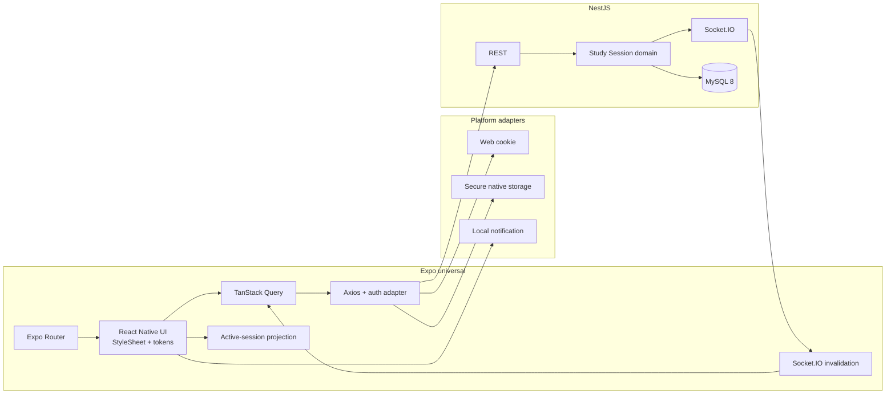

# Design — frontend universal Web, iOS e Android

**Data:** 03/09/2026
**Status:** Validado
**Origem:** entrevista registrada em
`docs/plans/2026-09-03-react-native-universal-discovery.md`
**Decisão arquitetural:** ADR-008, revisado neste design

## 1. Objetivo

Substituir o frontend Vite atual por uma aplicação Expo universal que funcione em
Web desktop e celulares iOS/Android. O produto preserva identidade, fluxos e
capacidades entre plataformas, mas adapta navegação e interação às convenções de
cada uma. Paridade não significa reprodução pixel a pixel.

Não existe frontend público a manter durante a transição. A migração ocorre no
workspace `apps/frontend`, em incrementos que deixam a branch principal
integrável e verificável.

## 2. Escopo

### Incluído

- Expo, Expo Router e React Native Web como runtime universal;
- autenticação segura com transporte específico por plataforma;
- Acampamento, Forja de foco, Personagem e Guilda;
- Pomodoro de 15/25/50 minutos, pausas de 5/15 e sequência 4× foco;
- uma sessão de estudo ativa por usuário, controlável em qualquer dispositivo;
- perda de conexão durante um foco já iniciado e reconciliação posterior;
- notificação local no celular que observou o ciclo;
- tema Ouro/Índigo derivado do standalone;
- dados reais sustentados por REST/OpenAPI e Socket.IO/AsyncAPI;
- pirâmide de testes orientada a regras de negócio.

### Excluído

- tablets como alvo formal de layout/QA;
- App Store, Google Play, TestFlight e distribuição pública;
- push remoto e notificações Web do sistema;
- áudio ambiente;
- temas Carmim, Verdor e Arcano selecionáveis;
- início totalmente offline ou pause/resume offline;
- dados fictícios em produção;
- implementação de Mercado Arcano, Crônicas e Configuração;
- persistência geral do cache e sincronização offline genérica.

## 3. Arquitetura



REST é a fonte canônica. TanStack Query mantém somente estado remoto em memória.
Socket.IO sinaliza mudanças e invalida queries; não sustenta outra cópia
autoritativa. Uma projeção persistida da sessão ativa reconstrói a interface e
guarda somente uma possível conclusão terminal pendente.

### Organização alvo

```text
apps/frontend/
├── app/
│   ├── (public)/
│   │   ├── entrar.tsx
│   │   └── cadastro.tsx
│   ├── (app)/
│   │   ├── _layout.tsx
│   │   ├── index.tsx
│   │   ├── sessao.tsx
│   │   ├── guilda.tsx
│   │   └── perfil.tsx
│   └── _layout.tsx
└── src/
    ├── core/{api,auth,query,realtime,storage,notifications}/
    ├── design-system/{components,tokens,icons}/
    └── features/{auth,sessions,dashboard,guilds,raids,profile}/
```

## 4. Design system e navegação

O standalone define a direção dark-RPG: Ouro/Índigo, Cinzel, Inter e JetBrains
Mono, superfícies profundas, runas, sigilos, cards ornamentados e feedback de XP.
Ele é referência de intenção, não código reutilizável nem especificação superior
ao domínio, acessibilidade ou contratos.

O design system usa `StyleSheet`, tokens TypeScript e componentes próprios como
`WiseCard`, `WiseButton`, `ProgressBar`, `ResourcePill`, `Screen`,
`AppNavigation` e `TimerRing`. Dependências pontuais fornecem fontes, SVG e
gradientes. Variantes `.web`/`.native` são permitidas somente quando necessárias.

Na Web, a navegação funcional usa sidebar. Em celulares, Acampamento, Forja,
Personagem e Guilda usam navegação inferior. Mercado Arcano, Crônicas e
Configuração aparecem em “Mais” como itens indisponíveis “Em breve”. Alvos têm
no mínimo 44×44 px, foco é visível, safe areas são respeitadas e movimento
reduzido desativa efeitos não essenciais.

## 5. Modelo de domínio

### Study Session

`StudySession` representa somente foco e contém:

- `id`, `userId`, matéria e modo solo/guilda;
- duração planejada e timestamps canônicos;
- prazo, pausa atual, duração pausada acumulada e versão;
- estado e razão terminal;
- segundos válidos, XP e contribuição de raid.

Estados: `running`, `paused`, `completed`, `stopped_early`, `cancelled` e
`discarded`.

`UserStudyState` mantém `activeSessionId` e a sequência de focos concluídos. O
backend bloqueia esse registro em transação antes de criar ou terminar uma sessão,
garantindo `activeStudySessions(userId) <= 1` sob concorrência.

### Regras

- uma sessão inicia online e pode ser controlada por qualquer dispositivo;
- pausa interna é ilimitada, canônica e não gera XP;
- pausar/retomar exige rede;
- nova sessão diante de uma pausa exige `Retomar` ou `Cancelar e iniciar outra`;
- ao chegar a zero, o foco conclui automaticamente e oferece uma pausa manual;
- encerramento antecipado após cinco minutos concede XP proporcional;
- taxa atual: `floor(validFocusSeconds / 60) * 10`;
- recompensa nunca ultrapassa a duração planejada;
- somente conclusão integral avança “Forja N de 4”;
- após quatro focos completos, a pausa oferecida é de 15 minutos; nas demais,
  5 minutos;
- pausa Pomodoro é contador local opcional e não uma Study Session.

## 6. Concorrência, offline e tempo real

Comandos mutáveis carregam chave idempotente e versão esperada. Repetir conclusão
retorna o resultado existente. Versão antiga provoca conflito explícito seguido
de refetch, nunca sobrescrita silenciosa.

Cada cliente calcula o contador pelo prazo canônico; não há eventos por segundo.
Ao voltar ao foreground, recuperar rede ou receber evento Socket.IO, o cliente
consulta a sessão ativa. Se o prazo for alcançado offline, registra uma conclusão
terminal pendente e idempotente. O servidor também conclui pelo prazo e leituras
posteriores corrigem eventual atraso do agendamento.

Notificação local informa apenas que o prazo previsto terminou e orienta abrir o
aplicativo. Ela não confirma XP, pois pode estar desatualizada se outro dispositivo
alterou a sessão enquanto o aparelho estava offline.

## 7. Autenticação e segurança

- access token efêmero somente em memória;
- Web mantém refresh token rotativo em cookie `httpOnly`/`Secure`;
- iOS/Android recebem credencial rotativa própria para armazenamento seguro;
- domínio de rotação, revogação, limite e logout global permanece único;
- logout remove credenciais e projeções locais;
- logs não registram tokens, senhas ou payloads sensíveis;
- notificações e projeções locais não contêm segredos.

## 8. Dados e estados de interface

Somente dados reais aparecem em produção. Missões, agenda, feed, atributos,
conquistas, inventário, presença e chat ficam ocultos ou futuros enquanto não
possuírem contrato. Fixtures são restritas a testes e previews identificados.

Toda tela implementa carregamento, vazio, erro, offline e permissão negada quando
aplicável. Erros são classificados em rede, autenticação, conflito e servidor.
Retry só aparece quando seguro e nunca simula sucesso.

## 9. Testes

- domínio: XP, mínimo de cinco minutos, arredondamento, antifraude, pausas,
  cadência 4× e máquina de estados;
- aplicação: projeção temporal, credenciais, conflitos e erros;
- componentes: formulários, acessibilidade, rede, navegação e controles;
- backend/banco: exclusividade, transações, concorrência, idempotência e concessão
  única de XP/raid;
- contratos: OpenAPI e AsyncAPI;
- E2E Web: autenticação e fluxo principal do Pomodoro;
- iOS/Android: checklist versionado para background, notificação, offline e
  multidispositivo.

Frontend usa Jest/jest-expo e React Native Testing Library. O backend mantém Jest.
A ferramenta E2E Web será fixada no plano de implementação após validar sua versão.

## 10. Entrega incremental

1. fundação Expo e builds Web/iOS/Android;
2. tokens, componentes e navegação;
3. autenticação universal;
4. sessão online exclusiva;
5. pausa, conclusão parcial e XP;
6. persistência, reconciliação e multidispositivo;
7. dashboard, perfil, guilda e raid;
8. acabamento, acessibilidade e documentação.

Cada incremento exige lint, tipos, testes relevantes e execução nas três
plataformas. A matriz de compatibilidade segue o Expo SDK fixado. Publicação em
lojas permanece um épico futuro.

## 11. Glossário

- **Frontend universal:** uma base de código para Web, iOS e Android.
- **Paridade funcional:** mesmos resultados de produto, com interação adaptada.
- **Sessão de dispositivo:** vínculo autenticado e revogável de navegador/app.
- **Study Session:** intervalo canônico de foco elegível para XP/raid.
- **Pausa interna:** suspensão ilimitada de uma Study Session.
- **Pausa Pomodoro:** contador local de descanso sem XP.
- **Projeção local:** cópia recuperável e não autoritativa da sessão ativa.
- **Reconciliação:** comparação da projeção com o estado canônico após reconectar.
- **Comando idempotente:** operação que produz um único efeito mesmo reenviada.
- **Invariante de exclusividade:** no máximo uma Study Session ativa por usuário.
- **Development build:** binário local próprio quando Expo Go não basta.

## 12. Referências versionadas

O frontend atual usa React 18.3.1, React Router 6.26.2, Vite 5.4.6 e TypeScript
5.6.2. A implementação substituirá parte dessa stack. Antes do primeiro código, o
plano deve registrar versões exatas de Expo SDK, React Native, React, Expo Router,
React Native Web, TanStack Query, Jest e React Native Testing Library a partir das
documentações oficiais.

Referências que guiaram este design:

- [Expo Router](https://docs.expo.dev/router/introduction/) — aplicação universal
  e módulos específicos por plataforma;
- [React Native for Web](https://necolas.github.io/react-native-web/docs/multi-platform/)
  — compatibilidade e recomendação de Expo;
- [React Native `AppState`](https://reactnative.dev/docs/appstate) —
  foreground/background;
- [Expo SQLite](https://docs.expo.dev/versions/latest/sdk/sqlite/) e
  [SecureStore](https://docs.expo.dev/versions/latest/sdk/securestore/) —
  persistência e credenciais nativas;
- [TanStack Query para React Native](https://tanstack.com/query/latest/docs/framework/react/react-native)
  — `onlineManager`, `focusManager` e network modes;
- [React Context](https://react.dev/reference/react/createContext) — estado global
  local limitado;
- `docs/Wise Warrior _standalone_.html` — direção visual e UX.
